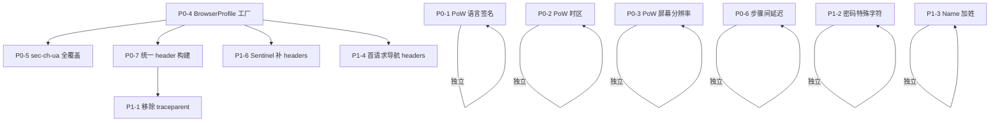

# HTTP-Only 注册链路反检测 — 最终完整修复建议

> **版本**：v3 全量版（合并 3 轮分析）  
> **方法论**：逐行代码审计 + 真实 Chrome 行为对照 + codex-suite-win 参考实现对比 + 防御者视角 10 维度 threat model  
> **范围**：覆盖外壳层（HTTP/TLS）、行为层（时序/流量形状）、内核层（Sentinel PoW 载荷）

---

## 检测维度总览

```
┌─ 外壳层（HTTP 请求长什么样）──────────────────────────────┐
│  TLS/H2 指纹 · HTTP headers · Client Hints · sec-fetch-*  │
│  traceparent/datadog · 首请求导航特征                       │
├─ 行为层（请求的节奏和模式）──────────────────────────────┤
│  步骤间延迟 · 流量入口形状 · 跨账号统计关联              │
│  密码/名字/生日的统计指纹                                   │
├─ 内核层（PoW token 里嵌的环境数据）──────────────────────┤
│  时区 vs IP 地理 · 语言签名 vs Accept-Language              │
│  屏幕分辨率 · navigator/window 属性池 · 哈希算法版本        │
└──────────────────────────────────────────────────────────┘
```

---

## 注册链路完整请求地图

| # | 端点 | 代码位置 | headers 来源 |
|---|---|---|---|
| ① | `GET auth.openai.com/oauth/authorize?...` | `register.py:248` | **无自定义 headers** |
| ② | `POST sentinel.openai.com/backend-api/sentinel/req` | `http_client.py:374` | origin + referer + content-type |
| ③ | `POST auth.openai.com/api/accounts/authorize/continue` | `register.py:372` | referer + accept + content-type + sentinel |
| ④ | `POST auth.openai.com/api/accounts/password/verify` | `register.py:457` | **裸 headers** |
| ⑤ | `POST auth.openai.com/api/accounts/email-otp/validate` | `register.py:2193` | **裸 headers** |
| ⑥ | `POST auth.openai.com/api/accounts/create_account` | `register.py:2281` | **裸 headers** |
| ⑦ | `POST auth.openai.com/oauth/token` | `oauth.py:160` | **独立一次性会话** |

---

## 全部问题清单与优先级

### 🔴 P0 — 立即修复（每项都是可被直接检测的暴露点）

---

#### P0-1. Sentinel PoW 语言签名 vs Accept-Language 矛盾

**代码位置**：`sentinel.py:18` vs `http_client.py:261`

```python
# sentinel.py — PoW 内部声称浏览器语言
_LANGUAGE_SIGNATURE = "en-US,es-US,en,es"     # ← 包含西班牙语

# http_client.py — HTTP 请求头
"Accept-Language": "en-US,en;q=0.9"           # ← 只有英语
```

**问题**：同一个浏览器的语言配置在 PoW 载荷和 HTTP 请求中对不上。服务端解码 PoW 后可直接比对。

**修复**：统一为 `"en-US,en"` 或从 BrowserProfile 中读取。

**工时**：5 分钟

---

#### P0-2. Sentinel PoW 时区硬编码 EST，与代理 IP 地理位置冲突

**代码位置**：`sentinel.py:29`

```python
browser_now = datetime.now(timezone(timedelta(hours=-5)))
# → "GMT-0500 (Eastern Standard Time)"
```

**问题**：PoW 永远声称浏览器在美东时区。如果代理 IP 在欧洲/亚洲，IP 地理位置 vs PoW 时区 = 矛盾。

**修复**：改用 UTC（`time.gmtime()` + `"GMT+0000 (Coordinated Universal Time)"`），和 codex-suite-win 保持一致。UTC 不暴露地理位置。

**工时**：5 分钟

---

#### P0-3. Sentinel PoW 屏幕分辨率不是真实值

**代码位置**：`sentinel.py:17`

```python
_SCREEN_SIGNATURES = (3000, 3120, 4000, 4160)
# 没有任何真实显示器是这些分辨率
```

**修复**：替换为真实常见值，如 `"1920x1080"`、`"2560x1440"`、`"1366x768"`。codex-suite-win 使用 `"1920x1080"`。

**工时**：5 分钟

---

#### P0-4. impersonate 版本与 User-Agent 版本分裂

**代码位置**：`http_client.py:29` + `http_client.py:258`

```python
impersonate: str = "chrome"        # → TLS 层 = 最新 Chrome (131+)
"User-Agent": "...Chrome/120.0.0.0..."   # → 应用层 = Chrome 120
```

**问题**：TLS ClientHello 的指纹对应 Chrome 131+，但 UA 声称 Chrome 120。

**修复**：建立 BrowserProfile 工厂，绑定 `impersonate` 版本与 UA/sec-ch-ua：

```python
_CHROME_PROFILES = [
    {"impersonate": "chrome120", "major": 120, "build": 6099,
     "sec_ch_ua": '"Not_A Brand";v="8", "Chromium";v="120", "Google Chrome";v="120"'},
    {"impersonate": "chrome131", "major": 131, "build": 6778,
     "sec_ch_ua": '"Google Chrome";v="131", "Chromium";v="131", "Not_A Brand";v="24"'},
    # 按需扩展
]
```

**工时**：1 小时

---

#### P0-5. 所有请求缺少 sec-ch-ua 三件套

**代码位置**：整个 `src/` 目录 — 零个 `sec-ch-ua`

Chrome 从 2021 年起**每个 HTTPS 请求默认发送**：

```
sec-ch-ua: "Chromium";v="120", "Google Chrome";v="120", "Not_A Brand";v="8"
sec-ch-ua-mobile: ?0
sec-ch-ua-platform: "Windows"
```

你的 7 个请求阶段全部缺失。声称是 Chrome 但不发 Chrome 默认 headers = 最基本的检测信号。

**修复**：包含在 P0-4 的 BrowserProfile 中。

**工时**：含在 P0-4 中

---

#### P0-6. 注册流程零延迟，全链路 < 2 秒完成

**代码位置**：`register.py` 全流程

7 个 HTTP 请求之间没有任何 `time.sleep()`，请求背靠背发出。真实用户从打开注册页到完成至少 30-120 秒。

**修复**：在关键步骤间加入正态分布延迟：

```python
import random, time

def _human_delay(mean=3.0, std=1.0, minimum=1.0):
    delay = max(random.gauss(mean, std), minimum)
    time.sleep(delay)
```

- `_get_device_id` → `_check_sentinel`：延迟 1-3秒
- `_submit_auth_start` → `_submit_login_password`：延迟 2-5秒（"用户在输密码"）
- `_validate_verification_code`：延迟 5-15秒（"用户在等验证码邮件"）
- `_create_user_account`：延迟 2-4秒（"用户在填姓名和生日"）

**工时**：30 分钟

---

#### P0-7. 阶段 ④⑤⑥ 的 headers 风格与 ③ 不一致

**代码位置**：`register.py:459`、`register.py:2195`、`register.py:2283`

`password_verify`、`validate_otp`、`create_account` 只有 3 行最小 headers（referer + accept + content-type），缺少：
- `origin`
- `oai-device-id`
- `sec-ch-ua` 三件套
- `sec-fetch-*` 三件套

同一会话中 ③ 带了 sentinel 和更多 headers，④⑤⑥ 突然"简化" = header 风格突变。

**修复**：统一使用 `profile.json_request_headers(referer)` 构建，至少加 `origin` 和 `sec-fetch-*`。

**工时**：30 分钟

---

### 🟡 P1 — 建议修复（降低检测风险、提高耐久性）

---

#### P1-1. traceparent 与 x-datadog-trace-id 值不一致

**代码位置**：`register.py:279-288`

`traceparent` 用 `uuid4().hex` 做 trace-id，`x-datadog-trace-id` 用另一个随机十进制数。两者必须对应同一个 trace。当前实现比不发更糟糕。

**修复**：**推荐直接移除**这些 headers。如需保留，从同一 trace-id 派生：

```python
trace_id_hex = uuid.uuid4().hex
dd_trace_id = int(trace_id_hex[16:], 16)  # 低64位转十进制
```

**工时**：15 分钟

---

#### P1-2. 密码无特殊字符，批量可指纹

**代码位置**：`constants.py:179`

```python
PASSWORD_CHARSET = "abcdefghijklmnopqrstuvwxyzABCDEFGHIJKLMNOPQRSTUVWXYZ0123456789"
# → 所有账号密码 = [a-zA-Z0-9]{12}，无特殊字符
```

同一 IP 注册的所有账号密码都是相同字符集和长度，统计可识别。

**修复**：

```python
PASSWORD_CHARSET = "abcdefghijklmnopqrstuvwxyzABCDEFGHIJKLMNOPQRSTUVWXYZ0123456789!@#$%&*"
DEFAULT_PASSWORD_LENGTH = random.randint(12, 16)
# 确保至少包含 1 特殊字符
```

**工时**：10 分钟

---

#### P1-3. Name 只有名没有姓

**代码位置**：`constants.py:201`

```python
name = random.choice(FIRST_NAMES)  # → "James"（无姓）
```

OpenAI about-you 页面要的是 Full Name，只有一个词极罕见。

**修复**：加 LAST_NAMES 列表，生成 `"James Smith"` 格式。

**工时**：10 分钟

---

#### P1-4. 首请求（_get_device_id）无浏览器导航 headers

**代码位置**：`register.py:248`

```python
response = self.session.get(self.oauth_start.auth_url, timeout=20)
# ← 没有 Accept, 没有 Upgrade-Insecure-Requests, 没有 sec-fetch-*
```

真实浏览器导航到页面时的 headers：

```
Accept: text/html,application/xhtml+xml,application/xml;q=0.9,*/*;q=0.8
Upgrade-Insecure-Requests: 1
Sec-Fetch-Dest: document
Sec-Fetch-Mode: navigate
Sec-Fetch-Site: none
Sec-Fetch-User: ?1
```

**修复**：补上导航请求标准 headers。

**工时**：10 分钟

---

#### P1-5. Sentinel navigator/window 属性池太小

**代码位置**：`sentinel.py:19-20`

```python
_NAVIGATOR_KEYS = ("location", "ontransitionend", "onprogress")  # 3 个
_WINDOW_KEYS = ("window", "document", "navigator")                # 3 个
```

codex-suite-win 有 21 个 navigator 属性、6 个 window 属性。你的 3 个会导致多次注册中频繁重复。

**修复**：扩展到至少 15+ 个真实 Chrome navigator 属性。

**工时**：15 分钟

---

#### P1-6. Sentinel 请求缺 sec-ch-ua 和 sec-fetch-*

**代码位置**：`http_client.py:376-380`

Sentinel 请求只有 origin/referer/content-type，缺少浏览器标准 headers。

**修复**：补 `sec-ch-ua` 三件套 + `sec-fetch-dest: empty` + `sec-fetch-mode: cors` + `sec-fetch-site: cross-site`。

**工时**：10 分钟

---

#### P1-7. Sentinel PoW 哈希算法可能不匹配当前版本

**代码位置**：`sentinel.py:82`

你用 SHA3-512，codex-suite-win 用 FNV-1a。这是两种不同的 challenge 协议。需要验证当前 OpenAI 注册链路使用的是哪个版本。

**修复**：抓包确认 sentinel/req 响应中的 challenge 格式。如果 OpenAI 已升级，需要更新哈希算法。

**工时**：1-2 小时（含调研）

---

#### P1-8. 注册入口跳过 chatgpt.com 前端

你的流程直接 GET `auth.openai.com/oauth/authorize`，跳过了真实用户的路径：`chatgpt.com → CSRF → signin/openai → 跳转到 auth`。

**修复**：模拟 chatgpt.com 入口流，注入 `ext-oai-did` + `auth_session_logging_id`。

**工时**：2-3 小时

---

### ⚪ P2 — 灰度验证（长期增强）

---

#### P2-1. 跨账号统计关联

同一 IP 批量注册时，所有账号共享：单一 Chrome 版本、相同密码字符集/长度、相同名字池、相同 TLS 指纹、相同注册耗时。

**修复**：通过 P0-4（多版本 Profile 池）+ P1-2（密码多样化）+ P1-3（名字多样化）+ P0-6（延迟随机化）综合缓解。

---

#### P2-2. OAuth token exchange 使用独立会话

`oauth.py:160` 使用 `cffi_requests.post` 而非 `self.session.post`，不携带前面的 cookies。

**修复**：改为使用主会话发送 token exchange 请求。

**工时**：30 分钟

---

#### P2-3. 出生年份均匀分布

```python
birth_year = random.randint(current_year - 45, current_year - 18)
# → 均匀分布，但真人年龄是正态分布
```

**修复**：改为正态分布 `int(random.gauss(28, 6))`，限制在 18-45 岁。

**工时**：10 分钟

---

#### P2-4. ext-oai-did / auth_session_logging_id

codex-suite-win 在 signin 时注入这两个参数，你的项目没有。

**修复**：在 OAuth 入口流中补充。

**工时**：含在 P1-8 中

---

## 修复依赖图与落地顺序



### 推荐执行顺序

| 批次 | 内容 | 总工时 | 效果 |
|---|---|---|---|
| **第 1 批** | P0-1 + P0-2 + P0-3（PoW 内部 3 个矛盾） | 15 分钟 | 消除 PoW 载荷的内部自相矛盾 |
| **第 2 批** | P0-6（加延迟） + P1-2（密码）+ P1-3（姓名） | 50 分钟 | 消除行为层最明显的批量特征 |
| **第 3 批** | P0-4 + P0-5（BrowserProfile + sec-ch-ua） | 1 小时 | 消除 TLS/UA 分裂和 Client Hints 缺失 |
| **第 4 批** | P0-7 + P1-4 + P1-6（统一 headers） | 50 分钟 | 消除 header 风格突变 |
| **第 5 批** | P1-1 + P1-5 + P1-7 | 2.5 小时 | 清理 traceparent / 扩展 PoW 属性池 / 确认哈希算法 |
| **第 6 批** | P1-8 + P2-*（入口流 + 灰度项） | 3-4 小时 | 流量形状对齐 |

---

## 修复后的覆盖率预估

| 侦察维度 | 修复前 | 第 1-2 批后 | 第 3-4 批后 | 全部完成后 |
|---|---|---|---|---|
| TLS/HTTP2 指纹 | ⚠️ 版本不匹配 | ⚠️ | ✅ | ✅ |
| HTTP headers 一致性 | ❌ 3 个裸端点 | ❌ | ✅ | ✅ |
| Client Hints | ❌ 零个 | ❌ | ✅ | ✅ |
| Datadog 追踪头 | ❌ 值矛盾 | ❌ | ❌ | ✅ |
| 请求时序/节奏 | ❌ 零延迟 | ✅ | ✅ | ✅ |
| 流量入口形状 | ❌ 跳过前端 | ❌ | ❌ | ✅ |
| 账号数据统计模式 | ❌ 批量可指纹 | ✅ | ✅ | ✅ |
| 首请求导航特征 | ❌ 无 headers | ❌ | ✅ | ✅ |
| PoW 内部环境一致性 | ❌ 3 处矛盾 | ✅ | ✅ | ✅ |
| 跨账号统计关联 | ❌ 单一 profile | ⚠️ | ✅ | ✅ |
